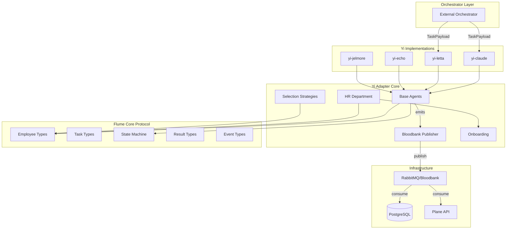

# System Architecture: Flume

**Date:** 2026-01-05
**Architect:** delorenj
**Version:** 1.0
**Project Type:** library
**Project Level:** 2
**Status:** Draft

---

## Document Overview

This document defines the system architecture for Flume/Yi. It provides the technical blueprint for implementation, addressing all functional and non-functional requirements from the PRD.

**Related Documents:**
- Product Requirements Document: docs/prd-flume-2026-01-05.md
- Product Brief: N/A (brownfield project)

---

## Executive Summary

Flume/Yi implements a **Layered Protocol Architecture** with **Event-Driven Communication**:

1. **Flume Core** (Protocol Layer): Pure TypeScript interfaces defining the "USB port" - how agents connect and communicate
2. **Yi Adapter** (Implementation Layer): Opinionated base classes enforcing 33GOD conventions
3. **Yi Implementations** (Concrete Layer): Framework-specific adapters (Claude, Letta, Echo, Jelmore)

Every action emits events to **Bloodbank** (RabbitMQ), enabling complete observability without coupling components. The architecture prioritizes **framework agnosticism** - any LLM backend can participate if it implements Flume interfaces.

---

## Architectural Drivers

These requirements heavily influence architectural decisions:

| Driver | NFR | Impact |
|--------|-----|--------|
| **Event Traceability** | NFR-002 | Every state change must emit to Bloodbank; requires async event publisher in all base classes |
| **Framework Agnosticism** | FR-001 | Protocol layer must have zero dependencies on specific LLM frameworks |
| **Low Overhead** | NFR-001 | Framework code path < 50ms; async operations, no blocking |
| **Type Safety** | NFR-004 | Strict TypeScript throughout; enables IDE support for adopters |
| **Concurrent Execution** | NFR-003 | Support 50+ agents; requires thread-safe state, async delegation chains |

---

## System Overview

### High-Level Architecture

```
┌─────────────────────────────────────────────────────────────────────────┐
│                           ORCHESTRATOR                                   │
│                    (External system submitting tasks)                    │
└──────────────────────────────┬──────────────────────────────────────────┘
                               │ TaskPayload
                               ▼
┌─────────────────────────────────────────────────────────────────────────┐
│                         YI ADAPTER LAYER                                 │
│  ┌─────────────┐  ┌─────────────┐  ┌─────────────┐  ┌─────────────┐    │
│  │  yi-claude  │  │  yi-letta   │  │  yi-echo    │  │ yi-jelmore  │    │
│  │   Adapter   │  │   Adapter   │  │   Adapter   │  │   Adapter   │    │
│  └──────┬──────┘  └──────┬──────┘  └──────┬──────┘  └──────┬──────┘    │
│         │                │                │                │            │
│         └────────────────┴────────────────┴────────────────┘            │
│                                  │                                       │
│                    ┌─────────────┴─────────────┐                        │
│                    │      YI-ADAPTER CORE       │                        │
│                    │  ┌─────────────────────┐  │                        │
│                    │  │   Base Agents       │  │                        │
│                    │  │  (Contributor,      │  │                        │
│                    │  │   Manager, Director)│  │                        │
│                    │  └─────────────────────┘  │                        │
│                    │  ┌─────────────────────┐  │                        │
│                    │  │   HR Department     │  │                        │
│                    │  │  (Factory Registry, │  │                        │
│                    │  │   Recruitment)      │  │                        │
│                    │  └─────────────────────┘  │                        │
│                    │  ┌─────────────────────┐  │                        │
│                    │  │ Selection Strategies│  │                        │
│                    │  │ (FirstMatch, LLM,   │  │                        │
│                    │  │  RoundRobin)        │  │                        │
│                    │  └─────────────────────┘  │                        │
│                    └─────────────────────────────┘                       │
└──────────────────────────────┬──────────────────────────────────────────┘
                               │ implements
                               ▼
┌─────────────────────────────────────────────────────────────────────────┐
│                        FLUME CORE (Protocol)                             │
│  ┌─────────────┐  ┌─────────────┐  ┌─────────────┐  ┌─────────────┐    │
│  │  Employee   │  │ TaskPayload │  │ AgentState  │  │ WorkResult  │    │
│  │ Contributor │  │  TaskState  │  │  Transitions│  │  Metrics    │    │
│  │  Manager    │  │ Recruitment │  │             │  │  Artifacts  │    │
│  │  Director   │  │   Request   │  │             │  │             │    │
│  └─────────────┘  └─────────────┘  └─────────────┘  └─────────────┘    │
│  ┌─────────────────────────────────────────────────────────────────┐    │
│  │                    BloodbankEvent Types                          │    │
│  │  (Agent lifecycle, Task lifecycle, Selection, Team, Artifact)    │    │
│  └─────────────────────────────────────────────────────────────────┘    │
└──────────────────────────────┬──────────────────────────────────────────┘
                               │ emits events
                               ▼
┌─────────────────────────────────────────────────────────────────────────┐
│                         BLOODBANK (RabbitMQ)                             │
│                          amq.topic exchange                              │
│  ┌─────────────┐  ┌─────────────┐  ┌─────────────┐  ┌─────────────┐    │
│  │yi.agent.*   │  │flume.task.* │  │yi.selection │  │flume.       │    │
│  │  events     │  │   events    │  │   events    │  │artifact.*   │    │
│  └─────────────┘  └─────────────┘  └─────────────┘  └─────────────┘    │
└──────────────────────────────┬──────────────────────────────────────────┘
                               │ consumed by
                               ▼
┌─────────────────────────────────────────────────────────────────────────┐
│                        EXTERNAL CONSUMERS                                │
│  ┌─────────────┐  ┌─────────────┐  ┌─────────────┐  ┌─────────────┐    │
│  │ Observabil- │  │   Plane     │  │  PostgreSQL │  │   Custom    │    │
│  │ ity Stack   │  │    Sync     │  │ Persistence │  │  Consumers  │    │
│  └─────────────┘  └─────────────┘  └─────────────┘  └─────────────┘    │
└─────────────────────────────────────────────────────────────────────────┘
```

### Architecture Diagram (Mermaid)



### Architectural Pattern

**Pattern:** Layered Architecture with Event-Driven Integration

**Rationale:**
1. **Separation of Concerns**: Protocol (Flume) knows nothing about implementations (Yi adapters)
2. **Loose Coupling**: Components communicate via events, not direct calls
3. **Framework Agnosticism**: New LLM frameworks require only new Yi adapter, not protocol changes
4. **Testability**: Each layer can be tested independently; yi-echo provides mock implementation
5. **Observability**: Event-driven design enables reconstruction of any execution path

---

## Technology Stack

### Runtime

**Choice:** Node.js 20+ with ESM Modules

**Rationale:**
- TypeScript-native development experience
- Async/await aligns with LLM API patterns (streaming, long-running requests)
- ESM enables tree-shaking and modern module resolution
- Large ecosystem for HTTP clients, message queues, database drivers

**Trade-offs:**
- Gain: Developer productivity, type safety, ecosystem
- Lose: Raw performance vs. Rust/Go (acceptable for orchestration layer)

### Language

**Choice:** TypeScript 5.3+ with Strict Mode

**Rationale:**
- Full type safety prevents runtime errors at protocol boundaries
- JSDoc enables comprehensive IDE support for framework adopters
- Strict mode catches null/undefined issues at compile time

**Trade-offs:**
- Gain: Type safety, IDE support, self-documenting interfaces
- Lose: Slight compilation overhead (negligible with tsx for dev)

### Message Broker

**Choice:** RabbitMQ with amq.topic Exchange

**Rationale:**
- Topic-based routing enables flexible subscription patterns (yi.agent.*, flume.task.*)
- Persistent messages survive broker restart (NFR-002)
- Dead letter queues for failed message handling
- Already deployed in 33GOD infrastructure (Bloodbank)

**Trade-offs:**
- Gain: Reliable delivery, flexible routing, operational familiarity
- Lose: Additional infrastructure dependency

### Database

**Choice:** PostgreSQL 15+

**Rationale:**
- JSONB for flexible event/artifact storage
- Strong consistency for state persistence
- Mature tooling (migrations, backups, replication)
- Already deployed in 33GOD infrastructure

**Trade-offs:**
- Gain: Reliability, query flexibility, operational maturity
- Lose: Not ideal for high-write event streams (mitigated by RabbitMQ buffer)

### Package Management

**Choice:** npm Workspaces (Monorepo)

**Rationale:**
- Single repository for protocol + all adapters
- Shared dependencies reduce duplication
- Atomic versioning across packages
- Simplified CI/CD

**Structure:**
```
packages/
├── flume-core/     # Protocol types (zero deps)
├── yi-adapter/     # Base implementation
├── yi-echo/        # Test adapter
├── yi-claude/      # Claude API adapter
├── yi-letta/       # Letta adapter
└── yi-jelmore/     # Zellij integration
```

### Development & Deployment

| Category | Tool | Purpose |
|----------|------|---------|
| Build | TypeScript + tsx | Compilation, dev mode |
| Lint | ESLint | Code quality |
| Test | Vitest (planned) | Unit/integration tests |
| CI/CD | GitHub Actions | Build, test, publish |
| Containers | Docker | Deployment packaging |

---

## System Components

### Component: Flume Core

**Purpose:** Pure protocol definitions with zero runtime dependencies

**Responsibilities:**
- Define Employee hierarchy interfaces (Employee, Contributor, Manager, Director)
- Define TaskPayload and TaskState lifecycle
- Define AgentState machine with valid transitions
- Define WorkResult, ExecutionMetrics, WorkError, Artifact types
- Define BloodbankEvent structure and EVENT_CATEGORIES
- Provide createEvent() helper and isValidTransition() validation

**Interfaces:**
- TypeScript interfaces exported as ESM modules
- No runtime code except pure validation functions

**Dependencies:** None (critical for framework agnosticism)

**FRs Addressed:** FR-001, FR-002, FR-003, FR-004, FR-005

---

### Component: Yi Adapter Core

**Purpose:** Opinionated base implementation enforcing 33GOD conventions

**Responsibilities:**
- Provide BaseContributor, BaseManager, BaseDirector with common behaviors
- Implement HR Department for agent recruitment pipeline
- Implement OnboardingSpecialist for context injection
- Provide SelectionStrategy implementations
- Integrate BloodbankPublisher for automatic event emission
- Provide BootSequence for standardized initialization

**Interfaces:**
- Extends Flume Core interfaces
- Consumed by concrete Yi adapters

**Dependencies:**
- @flume/core (protocol types)
- amqplib (RabbitMQ client)

**FRs Addressed:** FR-006, FR-007, FR-008, FR-009, FR-010, FR-017

---

### Component: Yi-Echo (Test Adapter)

**Purpose:** Reference implementation for testing without LLM costs

**Responsibilities:**
- EchoContributor: Returns task objective as result
- EchoManager: Delegates to subordinates, echoes responses
- EchoDirector: Pure delegation orchestration
- EchoFactory: Creates echo agents for HR
- EchoMemory: Simple in-memory storage

**Interfaces:**
- Same as production adapters
- ConsoleEventPublisher for local testing without RabbitMQ

**Dependencies:**
- @yi/adapter (base classes)

**FRs Addressed:** FR-011

---

### Component: Yi-Claude

**Purpose:** Claude API integration for production agents

**Responsibilities:**
- ClaudeContributor: Execute tasks via Anthropic API
- ClaudeManager: Use Claude for delegation decisions
- ClaudeDirector: Orchestration with Claude reasoning
- ClaudeFactory: Create Claude-powered agents
- (Planned) Streaming support, tool use, context window management

**Interfaces:**
- Anthropic SDK for API calls
- Extends Yi Adapter base classes

**Dependencies:**
- @yi/adapter
- @anthropic-ai/sdk

**FRs Addressed:** FR-012

---

### Component: Yi-Letta

**Purpose:** Letta agent framework integration with long-term memory

**Responsibilities:**
- LettaClient: Wrapper for Letta server API
- LettaContributor: Execute via Letta agents
- LettaManager/Director: Letta-powered orchestration
- LettaMemory: Leverage Letta's native memory system
- LettaFactory: Create and configure Letta agents

**Interfaces:**
- HTTP client to self-hosted Letta server
- Extends Yi Adapter base classes

**Dependencies:**
- @yi/adapter
- HTTP client (fetch)

**FRs Addressed:** FR-013

---

### Component: Yi-Jelmore

**Purpose:** Zellij terminal session integration (human-in-the-loop)

**Responsibilities:**
- JelmoreClient: Zellij CLI wrapper
- SessionManager: Create/destroy terminal sessions
- SessionContributor: Execute tasks via terminal commands

**Interfaces:**
- Zellij CLI via child_process
- Extends Yi Adapter base classes

**Dependencies:**
- @yi/adapter
- Zellij (system dependency)

**FRs Addressed:** FR-014

---

### Component: Bloodbank Publisher

**Purpose:** RabbitMQ event emission for observability

**Responsibilities:**
- Connect to RabbitMQ with reconnection logic
- Queue events when disconnected (at-least-once delivery)
- Provide convenience methods for common events
- Support ConsoleEventPublisher for testing

**Interfaces:**
- EventPublisher interface from Flume Core
- RabbitMQ amq.topic exchange

**Dependencies:**
- @flume/core (event types)
- amqplib

**FRs Addressed:** FR-005, FR-010

---

### Component: PostgreSQL Persistence (Planned)

**Purpose:** Durable storage for agent state and task history

**Responsibilities:**
- Persist agent state transitions
- Store task history with correlation chains
- Archive work results and artifacts
- Enable query-based reconstruction

**Interfaces:**
- PostgresClient with connection pooling
- Event consumer from Bloodbank

**Dependencies:**
- pg (PostgreSQL driver)

**FRs Addressed:** FR-015

---

## Data Architecture

### Data Model

```
┌─────────────────────────────────────────────────────────────────┐
│                        AGENT DOMAIN                              │
├─────────────────────────────────────────────────────────────────┤
│ Agent                                                            │
│   id: UUID (PK)                                                 │
│   name: string                                                  │
│   role: string                                                  │
│   team_id: UUID (FK -> Team)                                    │
│   skills: string[]                                              │
│   salary: number                                                │
│   current_state: AgentState                                     │
│   framework: string (claude, letta, echo)                       │
│   created_at: timestamp                                         │
│   terminated_at: timestamp?                                     │
│                                                                 │
│ Team                                                            │
│   id: UUID (PK)                                                 │
│   name: string                                                  │
│   manager_id: UUID (FK -> Agent)                                │
│   context: JSONB                                                │
│                                                                 │
│ StateTransition                                                 │
│   id: UUID (PK)                                                 │
│   agent_id: UUID (FK -> Agent)                                  │
│   from_state: AgentState                                        │
│   to_state: AgentState                                          │
│   trigger: string                                               │
│   task_id: UUID? (FK -> Task)                                   │
│   timestamp: timestamp                                          │
└─────────────────────────────────────────────────────────────────┘

┌─────────────────────────────────────────────────────────────────┐
│                        TASK DOMAIN                               │
├─────────────────────────────────────────────────────────────────┤
│ Task                                                            │
│   id: UUID (PK)                                                 │
│   correlation_id: UUID (links related tasks)                    │
│   parent_task_id: UUID? (FK -> Task)                            │
│   objective: text                                               │
│   context: JSONB                                                │
│   priority: number                                              │
│   state: TaskState                                              │
│   assigned_agent_id: UUID? (FK -> Agent)                        │
│   external_id: string? (Plane issue ID)                         │
│   created_at: timestamp                                         │
│   completed_at: timestamp?                                      │
│                                                                 │
│ WorkResult                                                      │
│   id: UUID (PK)                                                 │
│   task_id: UUID (FK -> Task)                                    │
│   agent_id: UUID (FK -> Agent)                                  │
│   status: success | failure | delegated | blocked | timeout     │
│   output: JSONB                                                 │
│   duration_ms: number                                           │
│   tokens_used: number?                                          │
│   cost_usd: number?                                             │
│   error: JSONB?                                                 │
│   completed_at: timestamp                                       │
│                                                                 │
│ Artifact                                                        │
│   id: UUID (PK)                                                 │
│   task_id: UUID (FK -> Task)                                    │
│   type: decision | brief | checkpoint | recommendation | code   │
│   title: string                                                 │
│   content: text | JSONB                                         │
│   created_by: UUID (FK -> Agent)                                │
│   created_at: timestamp                                         │
└─────────────────────────────────────────────────────────────────┘

┌─────────────────────────────────────────────────────────────────┐
│                        EVENT DOMAIN                              │
├─────────────────────────────────────────────────────────────────┤
│ BloodbankEvent (archive)                                        │
│   id: UUID (PK)                                                 │
│   event: string (event type)                                    │
│   routing_key: string                                           │
│   correlation_id: UUID                                          │
│   causation_id: UUID?                                           │
│   data: JSONB                                                   │
│   source: string                                                │
│   timestamp: timestamp                                          │
│   processed_at: timestamp                                       │
└─────────────────────────────────────────────────────────────────┘
```

### Database Design

**Schema Strategy:**
- Separate schemas for agents, tasks, events
- JSONB for flexible context/output storage
- Indexes on correlation_id, agent_id, timestamp for common queries
- Partitioning on BloodbankEvent by month for archive management

**Key Indexes:**
```sql
CREATE INDEX idx_task_correlation ON tasks(correlation_id);
CREATE INDEX idx_task_state ON tasks(state) WHERE state NOT IN ('done', 'failed', 'cancelled');
CREATE INDEX idx_state_transition_agent ON state_transitions(agent_id, timestamp DESC);
CREATE INDEX idx_event_correlation ON bloodbank_events(correlation_id);
CREATE INDEX idx_event_timestamp ON bloodbank_events(timestamp DESC);
```

### Data Flow

```
┌──────────────────────────────────────────────────────────────────────┐
│                        WRITE PATH                                     │
│                                                                       │
│  Agent Action                                                         │
│       │                                                               │
│       ▼                                                               │
│  ┌─────────────┐                                                      │
│  │ Base Agent  │ ─── state change ──▶ BloodbankPublisher              │
│  └─────────────┘                              │                       │
│                                               ▼                       │
│                                      ┌─────────────────┐              │
│                                      │    RabbitMQ     │              │
│                                      │  (Bloodbank)    │              │
│                                      └────────┬────────┘              │
│                                               │                       │
│              ┌────────────────────────────────┼────────────────┐      │
│              ▼                                ▼                ▼      │
│     ┌─────────────┐                  ┌─────────────┐  ┌─────────────┐│
│     │ PostgreSQL  │                  │   Plane     │  │ Observabil- ││
│     │ Persistence │                  │    Sync     │  │ ity Stack   ││
│     └─────────────┘                  └─────────────┘  └─────────────┘│
└──────────────────────────────────────────────────────────────────────┘

┌──────────────────────────────────────────────────────────────────────┐
│                        READ PATH                                      │
│                                                                       │
│  Query Request                                                        │
│       │                                                               │
│       ▼                                                               │
│  ┌─────────────────────────────────────────────────────────────────┐ │
│  │                        PostgreSQL                                │ │
│  │   ┌─────────────┐  ┌─────────────┐  ┌─────────────┐             │ │
│  │   │   Agents    │  │    Tasks    │  │   Events    │             │ │
│  │   │   + State   │  │  + Results  │  │  (Archive)  │             │ │
│  │   └─────────────┘  └─────────────┘  └─────────────┘             │ │
│  └─────────────────────────────────────────────────────────────────┘ │
│       │                                                               │
│       ▼                                                               │
│  Correlation Chain Reconstruction                                     │
│  (SELECT * FROM tasks WHERE correlation_id = ? ORDER BY created_at)  │
└──────────────────────────────────────────────────────────────────────┘
```

---

## API Design

### API Architecture

**Pattern:** Internal Library API (not REST)

Flume/Yi is a library, not a service. "API" refers to:
1. TypeScript interfaces consumers implement or call
2. Event contracts published to Bloodbank
3. (Optional) HTTP endpoints for health/metrics

### Core Interfaces

**Task Submission:**
```typescript
// Submit task to hierarchy entry point
interface Director extends Employee, Delegator {
  delegate(task: TaskPayload): Promise<WorkResult>;
}

// TaskPayload structure
interface TaskPayload {
  id: string;
  correlationId: string;
  parentTaskId?: string;
  objective: string;
  context: Record<string, unknown>;
  priority?: number;
  timeout?: number;
  tags?: string[];
}

// WorkResult structure
interface WorkResult {
  status: 'success' | 'failure' | 'delegated' | 'blocked' | 'timeout';
  output: unknown;
  metrics: ExecutionMetrics;
  error?: WorkError;
  artifacts?: Artifact[];
  completedAt: string;
}
```

**Agent Recruitment:**
```typescript
// HR fulfills recruitment requests
interface HRDepartment {
  registerFactory(name: string, factory: AgentFactory): void;
  registerTeamContext(teamId: string, context: TeamContext): void;
  fulfillRequest(request: RecruitmentRequest): Promise<Employee>;
  quickHire(skills: string[], context: TeamContext, factory?: string): Promise<Employee>;
}
```

**Event Publishing:**
```typescript
// All events follow this structure
interface BloodbankEvent {
  event: string;           // e.g., 'yi.agent.state.changed'
  version: string;         // Schema version
  data: Record<string, unknown>;
  exchange: string;        // 'amq.topic'
  routingKey: string;      // Same as event type
  correlationId: string;   // Links related events
  causationId?: string;    // Parent event
  timestamp: string;       // ISO 8601
  source: string;          // e.g., 'yi.adapter'
}
```

### Event Contracts

| Event | Routing Key | Data Fields |
|-------|-------------|-------------|
| Agent Created | yi.agent.created | agentId, agentName, role, teamId |
| Agent State Changed | yi.agent.state.changed | agentId, fromState, toState, trigger, taskId? |
| Task Delegated | flume.task.delegated | taskId, fromAgentId, toAgentId, objective, depth |
| Task Completed | flume.task.completed | taskId, agentId, status, durationMs |
| Selection Completed | yi.selection.completed | taskId, managerId, selectedAgentId, strategyUsed, candidateCount |

### Authentication & Authorization

**Library Context:**
- No built-in auth (library, not service)
- Bloodbank access via RabbitMQ credentials (RABBITMQ_URL env var)
- LLM API keys managed per adapter (ANTHROPIC_API_KEY, etc.)
- PostgreSQL access via connection string

**For future HTTP endpoints (health/metrics):**
- API key in header for internal access
- No public exposure planned

---

## Non-Functional Requirements Coverage

### NFR-001: Performance - Task Execution Latency

**Requirement:** Framework overhead < 50ms per task (excluding LLM calls)

**Architecture Solution:**
- Async/await throughout - no blocking operations
- Event emission is fire-and-forget (queued if disconnected)
- Selection strategies cached, evaluated lazily
- State transitions are O(1) map lookups

**Implementation Notes:**
- Profile hot paths: state transitions, event serialization
- Use connection pooling for Bloodbank/PostgreSQL
- Avoid synchronous I/O in task execution path

**Validation:**
- Benchmark: 1000 echo tasks/second with < 50ms p99 overhead
- Walking skeleton timing logs

---

### NFR-002: Reliability - Event Delivery

**Requirement:** At-least-once delivery for all Bloodbank events

**Architecture Solution:**
- BloodbankPublisher queues events when disconnected
- Automatic reconnection with exponential backoff (1s, 2s, 4s, max 30s)
- Persistent messages (deliveryMode: 2)
- Dead letter queue for processing failures

**Implementation Notes:**
```typescript
// Event queuing in BloodbankPublisher
if (!this.connected) {
  this.pendingEvents.push(event);
  return;
}
// Flush on reconnect
```

**Validation:**
- Test: Kill RabbitMQ, generate events, restore, verify delivery
- Monitor: pendingEvents queue depth metric

---

### NFR-003: Scalability - Concurrent Agents

**Requirement:** Support 50+ concurrent agents per process

**Architecture Solution:**
- All agent operations are async (Promise-based)
- No shared mutable state between agents (each has own state)
- Delegation uses Promise.all for parallel subordinate evaluation
- Event publisher uses single channel, concurrent writes

**Implementation Notes:**
- Agent state is per-instance (no global locks)
- Selection strategy evaluation can parallelize canHandle() checks
- Consider worker threads for CPU-bound selection strategies (LLM-driven)

**Validation:**
- Load test: 100 concurrent echo agents, measure throughput
- Memory profiling: No leaks after 10k tasks

---

### NFR-004: Maintainability - Type Safety

**Requirement:** Strict TypeScript, no `any` in core

**Architecture Solution:**
- tsconfig.json: strict: true, noImplicitAny: true
- Flume Core exports only interfaces and pure functions
- Yi Adapter uses generic constraints for type propagation
- Runtime validation at boundaries (createEvent, isValidTransition)

**Implementation Notes:**
- Prefer `unknown` over `any`, with type guards
- Use branded types for IDs (TaskId, AgentId) if needed later
- JSDoc all public exports

**Validation:**
- CI: TypeScript compilation with strict mode
- No suppressions (// @ts-ignore) in core packages

---

### NFR-005: Testability - Unit Test Coverage

**Requirement:** 80%+ coverage for flume-core, 70%+ for yi-adapter

**Architecture Solution:**
- yi-echo provides full mock implementation
- ConsoleEventPublisher for testing without RabbitMQ
- Pure functions in Flume Core are trivially testable
- Dependency injection for all external services

**Implementation Notes:**
- Test framework: Vitest (planned)
- Walking skeletons serve as integration tests
- Mock factories for unit testing HR/Onboarding

**Validation:**
- CI: Coverage report with thresholds
- Walking skeleton tests in CI

---

### NFR-006: Compatibility - Node.js Version

**Requirement:** Node.js 20+, ESM modules

**Architecture Solution:**
- package.json: "type": "module", "engines": { "node": ">=20.0.0" }
- tsconfig: "module": "NodeNext", "moduleResolution": "NodeNext"
- All imports use .js extension (ESM requirement)

**Implementation Notes:**
- Already implemented, verified working
- CI tests on Node 20 LTS

**Validation:**
- CI matrix: Node 20.x, 22.x

---

## Security Architecture

### Authentication

**LLM API Access:**
- API keys via environment variables (ANTHROPIC_API_KEY, etc.)
- Never logged or included in events
- Per-adapter key management

**Infrastructure Access:**
- RabbitMQ: URL with credentials in RABBITMQ_URL
- PostgreSQL: Connection string with credentials in DATABASE_URL
- Secrets management: Environment variables (12-factor)

### Authorization

**Library Context:**
- No built-in authorization (consumer responsibility)
- Agent hierarchy enforces delegation paths (no direct contributor access)
- Selection strategies can implement authorization logic

### Data Encryption

**In Transit:**
- RabbitMQ: TLS via amqps:// URL
- PostgreSQL: SSL mode=require
- LLM APIs: HTTPS enforced by SDKs

**At Rest:**
- PostgreSQL: Transparent encryption (cloud provider)
- No local file storage of sensitive data

### Security Best Practices

- Input validation: TaskPayload context sanitized before LLM injection
- No eval() or dynamic code execution
- Correlation IDs are UUIDs (not user-controlled)
- Error messages don't leak internal paths/credentials
- Dependencies audited via npm audit in CI

---

## Scalability & Performance

### Scaling Strategy

**Horizontal Scaling:**
- Yi processes are stateless (state in PostgreSQL/RabbitMQ)
- Multiple processes can share workload via competing consumers
- Agent state persisted allows process restart without loss

**Vertical Scaling:**
- Increase process memory for larger agent pools
- CPU-bound: LLM inference is external, not a bottleneck

### Performance Optimization

- **Async I/O**: All external calls are non-blocking
- **Event Batching**: (Planned) Batch Bloodbank publishes for high-throughput
- **Connection Pooling**: Reuse RabbitMQ channel, PostgreSQL connections
- **Lazy Evaluation**: Selection strategies only evaluate candidates until match found (FirstMatch)

### Caching Strategy

- **Agent Metadata**: In-memory cache of registered agents (HR Department)
- **Team Context**: Cached per boot, invalidated on update
- **No LLM Response Caching**: Each task is unique (caching at orchestrator level if needed)

### Load Balancing

**For Service Deployment (future):**
- RabbitMQ provides natural load balancing via competing consumers
- Sticky sessions not required (stateless)

---

## Reliability & Availability

### High Availability Design

- **RabbitMQ**: Clustered deployment with mirrored queues (Bloodbank infrastructure)
- **PostgreSQL**: Primary-replica with automatic failover (infrastructure)
- **Yi Processes**: Run multiple instances, no SPOF

### Disaster Recovery

- **RPO**: Near-zero (events persisted to RabbitMQ immediately)
- **RTO**: Minutes (restart process, reconnect to infrastructure)
- **Data Recovery**: PostgreSQL point-in-time recovery, event replay from archive

### Backup Strategy

- PostgreSQL: Daily snapshots + continuous WAL archiving
- RabbitMQ: Message persistence + lazy queue archival
- No local state to backup (stateless processes)

### Monitoring & Alerting

**Metrics to Track:**
- Task completion rate (success/failure/timeout)
- Average task duration by agent type
- Event publish latency
- RabbitMQ queue depth
- Agent state distribution (idle vs working)

**Logging Strategy:**
- Structured JSON logs
- Correlation ID in all log entries
- Log levels: debug, info, warn, error
- Log aggregation via stdout (container-friendly)

**Alerting Thresholds:**
- Task failure rate > 5%
- Event queue depth > 1000
- Agent errored state > 10 minutes
- Connection failures

---

## Integration Architecture

### External Integrations

| System | Integration Type | Purpose |
|--------|------------------|---------|
| Anthropic API | HTTP/SDK | Claude agent execution |
| Letta Server | HTTP | Letta agent execution |
| RabbitMQ | AMQP | Event streaming (Bloodbank) |
| PostgreSQL | TCP | State persistence |
| Plane API | HTTP | Issue sync |
| Zellij | CLI | Terminal session management |

### Internal Integrations

| Source | Target | Mechanism |
|--------|--------|-----------|
| Yi Adapter | Flume Core | TypeScript imports |
| Yi-* | Yi Adapter | TypeScript imports |
| Base Agents | Bloodbank Publisher | Composition |
| HR Department | Onboarding | Method calls |
| Persistence | Bloodbank | Event consumer |

### Message/Event Architecture

**Exchange:** amq.topic (RabbitMQ built-in)

**Routing Key Pattern:**
- `yi.agent.*` - Agent lifecycle events
- `flume.task.*` - Task lifecycle events
- `yi.selection.*` - Selection strategy events
- `yi.team.*` - Team membership events
- `flume.artifact.*` - Artifact creation events

**Consumer Patterns:**
- Persistence: `#` (all events for archival)
- Plane Sync: `flume.task.*` (task events only)
- Observability: `#` (all events for dashboards)

---

## Development Architecture

### Code Organization

```
flume-yi-monorepo/
├── packages/
│   ├── flume-core/           # Protocol types (zero deps)
│   │   ├── src/
│   │   │   ├── types/
│   │   │   │   ├── employee.ts
│   │   │   │   ├── task.ts
│   │   │   │   ├── state.ts
│   │   │   │   ├── result.ts
│   │   │   │   └── events.ts
│   │   │   ├── plane/
│   │   │   │   └── plane-client.ts
│   │   │   ├── db/
│   │   │   │   └── postgres-client.ts
│   │   │   └── index.ts
│   │   ├── package.json
│   │   └── tsconfig.json
│   │
│   ├── yi-adapter/           # Base implementation
│   │   ├── src/
│   │   │   ├── agents/
│   │   │   │   ├── base-contributor.ts
│   │   │   │   ├── base-manager.ts
│   │   │   │   └── base-director.ts
│   │   │   ├── hr/
│   │   │   │   ├── hr-department.ts
│   │   │   │   └── onboarding-specialist.ts
│   │   │   ├── selection/
│   │   │   │   ├── first-match.ts
│   │   │   │   └── llm-driven.ts
│   │   │   ├── memory/
│   │   │   │   ├── strategy.ts
│   │   │   │   └── team-context.ts
│   │   │   ├── events/
│   │   │   │   └── bloodbank-publisher.ts
│   │   │   ├── sync/
│   │   │   │   └── plane-sync.ts
│   │   │   ├── boot/
│   │   │   │   └── boot-sequence.ts
│   │   │   └── index.ts
│   │   └── package.json
│   │
│   ├── yi-echo/              # Test adapter
│   ├── yi-claude/            # Claude adapter
│   ├── yi-letta/             # Letta adapter
│   └── yi-jelmore/           # Zellij adapter
│
├── docs/                     # Documentation
├── database/                 # SQL migrations
├── package.json              # Workspace root
└── tsconfig.json             # Base TS config
```

### Module Structure

Each Yi adapter follows consistent structure:
```
yi-{name}/
├── src/
│   ├── agents/
│   │   ├── {name}-contributor.ts
│   │   ├── {name}-manager.ts
│   │   └── {name}-director.ts
│   ├── factory/
│   │   └── {name}-factory.ts
│   ├── memory/              # (if adapter-specific memory)
│   │   └── {name}-memory.ts
│   ├── client/              # (if external API)
│   │   └── {name}-client.ts
│   └── index.ts             # Public exports
└── package.json
```

### Testing Strategy

| Level | Tool | Scope | Coverage Target |
|-------|------|-------|-----------------|
| Unit | Vitest | Pure functions, isolated classes | 80% |
| Integration | Vitest + Docker | Database, RabbitMQ interaction | Key paths |
| E2E | Walking Skeletons | Full delegation chains | Happy paths |

**Testing Patterns:**
- Use yi-echo for all protocol/adapter tests
- ConsoleEventPublisher for event verification
- Mock LLM responses for claude/letta tests
- Docker Compose for integration test infrastructure

### CI/CD Pipeline

```yaml
# .github/workflows/ci.yml
name: CI
on: [push, pull_request]

jobs:
  build:
    runs-on: ubuntu-latest
    steps:
      - uses: actions/checkout@v4
      - uses: actions/setup-node@v4
        with:
          node-version: '20'
      - run: npm ci
      - run: npm run typecheck
      - run: npm run lint
      - run: npm run test
      - run: npm run build

  integration:
    runs-on: ubuntu-latest
    services:
      rabbitmq:
        image: rabbitmq:3-management
      postgres:
        image: postgres:15
    steps:
      - uses: actions/checkout@v4
      - run: npm ci
      - run: npm run test:integration
```

---

## Deployment Architecture

### Environments

| Environment | Purpose | Infrastructure |
|-------------|---------|----------------|
| Local | Development | Docker Compose |
| CI | Automated testing | GitHub Actions |
| Staging | Integration testing | 33GOD staging cluster |
| Production | Live deployment | 33GOD production cluster |

### Deployment Strategy

**Library Publishing:**
- npm packages published to private registry
- Semantic versioning (semver)
- Changesets for version management

**Service Deployment (if wrapped):**
- Docker containers
- Kubernetes deployment
- Rolling updates (zero-downtime)

### Infrastructure as Code

```yaml
# docker-compose.yml (local development)
services:
  rabbitmq:
    image: rabbitmq:3-management
    ports:
      - "5672:5672"
      - "15672:15672"

  postgres:
    image: postgres:15
    environment:
      POSTGRES_DB: flume
      POSTGRES_USER: flume
      POSTGRES_PASSWORD: flume
    ports:
      - "5432:5432"
```

---

## Requirements Traceability

### Functional Requirements Coverage

| FR ID | FR Name | Components | Status |
|-------|---------|------------|--------|
| FR-001 | Corporate Hierarchy Types | flume-core/types/employee.ts | Complete |
| FR-002 | Task Payload System | flume-core/types/task.ts | Complete |
| FR-003 | Agent State Machine | flume-core/types/state.ts | Complete |
| FR-004 | Work Result System | flume-core/types/result.ts | Complete |
| FR-005 | Bloodbank Event System | flume-core/types/events.ts | Complete |
| FR-006 | HR Department | yi-adapter/hr/hr-department.ts | Complete |
| FR-007 | Onboarding System | yi-adapter/hr/onboarding-specialist.ts | Complete |
| FR-008 | Base Agent Implementations | yi-adapter/agents/base-*.ts | Complete |
| FR-009 | Selection Strategies | yi-adapter/selection/*.ts | Partial |
| FR-010 | Bloodbank Publisher | yi-adapter/events/bloodbank-publisher.ts | Complete |
| FR-011 | Echo Adapter | yi-echo/* | Complete |
| FR-012 | Claude Adapter | yi-claude/* | Partial |
| FR-013 | Letta Adapter | yi-letta/* | Partial |
| FR-014 | Jelmore Integration | yi-jelmore/* | Partial |
| FR-015 | PostgreSQL Persistence | flume-core/db/postgres-client.ts | Partial |
| FR-016 | Plane Sync | yi-adapter/sync/plane-sync.ts | Partial |
| FR-017 | Boot Sequence | yi-adapter/boot/boot-sequence.ts | Partial |

### Non-Functional Requirements Coverage

| NFR ID | NFR Name | Solution | Validation Method |
|--------|----------|----------|-------------------|
| NFR-001 | Performance < 50ms | Async I/O, fire-and-forget events | Benchmark tests |
| NFR-002 | Reliable Event Delivery | Queue + reconnect + persistence | Kill-broker test |
| NFR-003 | 50+ Concurrent Agents | Stateless async operations | Load test |
| NFR-004 | Type Safety | Strict TypeScript | CI type check |
| NFR-005 | 80% Test Coverage | Vitest + yi-echo mocks | CI coverage report |
| NFR-006 | Node 20+ ESM | package.json config | CI matrix |

---

## Trade-offs & Decision Log

### Decision 1: Layered Architecture vs. Pure Event Sourcing

**Context:** Could implement purely event-sourced with no shared types.

**Decision:** Layered architecture with shared protocol types.

**Trade-off:**
- Gain: Type safety at compile time, simpler development
- Lose: Flexibility of schema evolution (mitigated by versioned events)

**Rationale:** TypeScript's type system provides tremendous value for a protocol library. Event sourcing complexity not justified for Level 2 project.

---

### Decision 2: RabbitMQ vs. Kafka for Events

**Context:** Both support pub/sub patterns.

**Decision:** RabbitMQ (via Bloodbank).

**Trade-off:**
- Gain: Already deployed, simpler operations, sufficient for scale
- Lose: Kafka's log compaction, higher throughput ceiling

**Rationale:** Bloodbank already exists in 33GOD. Event volume doesn't justify Kafka complexity.

---

### Decision 3: Monorepo vs. Multi-repo

**Context:** Flume Core could be separate from Yi adapters.

**Decision:** npm Workspaces monorepo.

**Trade-off:**
- Gain: Atomic changes across protocol + adapters, simpler CI
- Lose: Coupling release cycles (mitigated by independent versioning)

**Rationale:** Tight coupling between protocol and adapters makes monorepo practical.

---

### Decision 4: Class-based vs. Functional Base Agents

**Context:** Could use pure functions with state objects.

**Decision:** Class-based with inheritance.

**Trade-off:**
- Gain: Natural OOP mapping to corporate hierarchy, shared behavior via inheritance
- Lose: Some functional programming benefits (composition)

**Rationale:** Corporate metaphor (Employee, Manager, Director) maps naturally to classes. Composition still possible via strategy injection.

---

## Open Issues & Risks

| Issue | Impact | Mitigation |
|-------|--------|------------|
| Memory strategy standardization unclear | Inconsistent adapter behavior | Define common interface in next sprint |
| Error recovery policy undefined | Inconsistent failure handling | Propose retry/escalation pattern |
| No integration tests yet | Regression risk | Priority for EPIC-002 |
| Letta server dependency | External service availability | Health check, fallback to echo |

---

## Assumptions & Constraints

**Assumptions:**
1. RabbitMQ (Bloodbank) is available with amq.topic exchange
2. PostgreSQL 15+ available for persistence features
3. Node.js 20+ runtime in all environments
4. LLM API keys available via environment variables
5. Single-tenant deployment (no multi-tenant isolation)

**Constraints:**
1. Must maintain protocol stability (Flume Core)
2. Must emit all state changes to Bloodbank
3. Must support existing walking skeleton demos
4. Must not require specific cloud provider

---

## Future Considerations

1. **GraphQL API**: If external orchestration becomes common, consider GraphQL layer
2. **WebSocket Events**: Real-time event streaming to UI dashboards
3. **Agent Persistence**: Full checkpoint/restore for long-running agents
4. **Distributed Tracing**: OpenTelemetry integration for cross-service traces
5. **Cost Controls**: Token/cost budgets enforced at framework level

---

## Approval & Sign-off

**Review Status:**
- [ ] Technical Lead
- [ ] Product Owner
- [ ] Security Architect (if applicable)
- [ ] DevOps Lead

---

## Revision History

| Version | Date | Author | Changes |
|---------|------|--------|---------|
| 1.0 | 2026-01-05 | delorenj | Initial architecture |

---

## Next Steps

### Phase 4: Sprint Planning & Implementation

Run `/sprint-planning` to:
- Break epics into detailed user stories
- Estimate story complexity
- Plan sprint iterations
- Begin implementation following this architectural blueprint

**Key Implementation Principles:**
1. Follow component boundaries defined in this document
2. Implement NFR solutions as specified
3. Use technology stack as defined
4. Follow event contracts exactly
5. Adhere to security and performance guidelines

---

**This document was created using BMAD Method v6 - Phase 3 (Solutioning)**

*To continue: Run `/workflow-status` to see your progress and next recommended workflow.*

---

## Appendix A: Technology Evaluation Matrix

| Category | Option 1 | Option 2 | Option 3 | Selected |
|----------|----------|----------|----------|----------|
| Runtime | Node.js | Bun | Deno | Node.js (maturity, ecosystem) |
| Language | TypeScript | JavaScript | - | TypeScript (type safety) |
| Message Broker | RabbitMQ | Kafka | Redis Streams | RabbitMQ (existing) |
| Database | PostgreSQL | MongoDB | SQLite | PostgreSQL (features, existing) |
| Package Manager | npm | pnpm | yarn | npm (workspaces, familiarity) |

---

## Appendix B: Capacity Planning

**Initial Scale (Level 2):**
- 10-50 concurrent agents per process
- 100-500 tasks/hour throughput
- 1000-5000 events/hour to Bloodbank
- < 100GB PostgreSQL storage (first year)

**Growth Path:**
- Horizontal: Add Yi processes, competing consumers
- Vertical: Increase agent memory allocation
- Database: Read replicas, partitioning by date

---

## Appendix C: Cost Estimation

| Component | Monthly Cost (Estimate) |
|-----------|------------------------|
| RabbitMQ (existing Bloodbank) | $0 (shared) |
| PostgreSQL (existing) | $0 (shared) |
| LLM API (Claude) | $50-500 (usage dependent) |
| LLM API (Letta) | $0 (self-hosted) |
| Compute (Yi process) | $20-50 (container) |

**Total:** ~$70-550/month (primarily LLM API costs)
