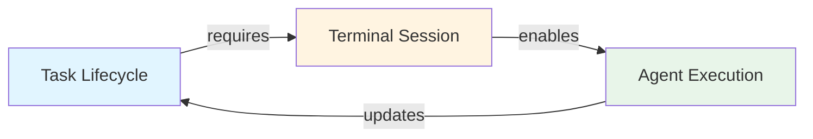
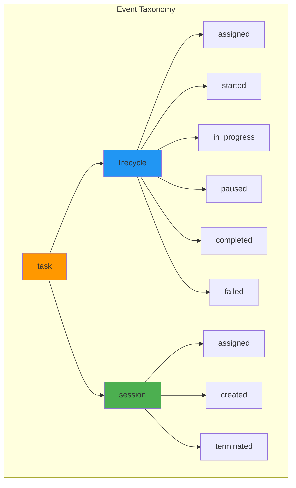
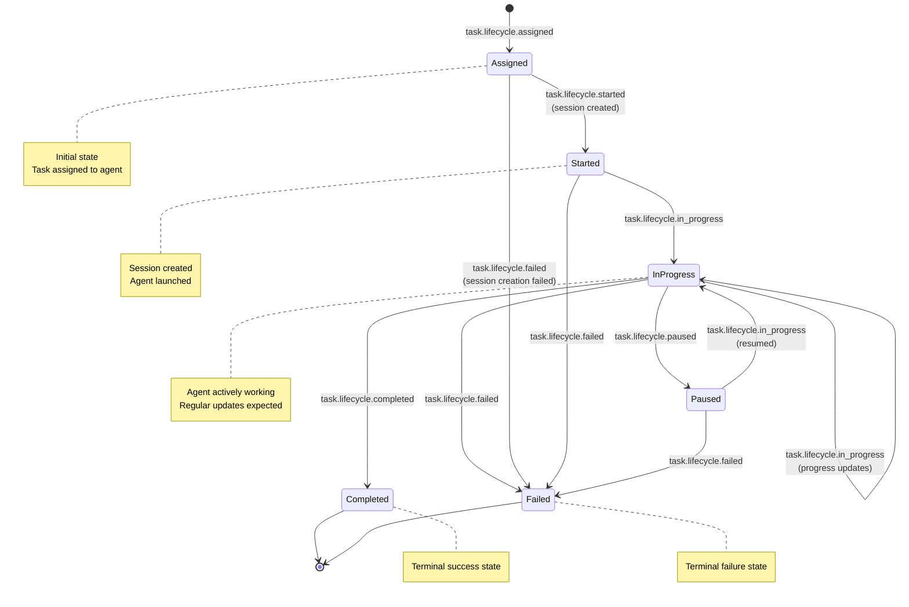
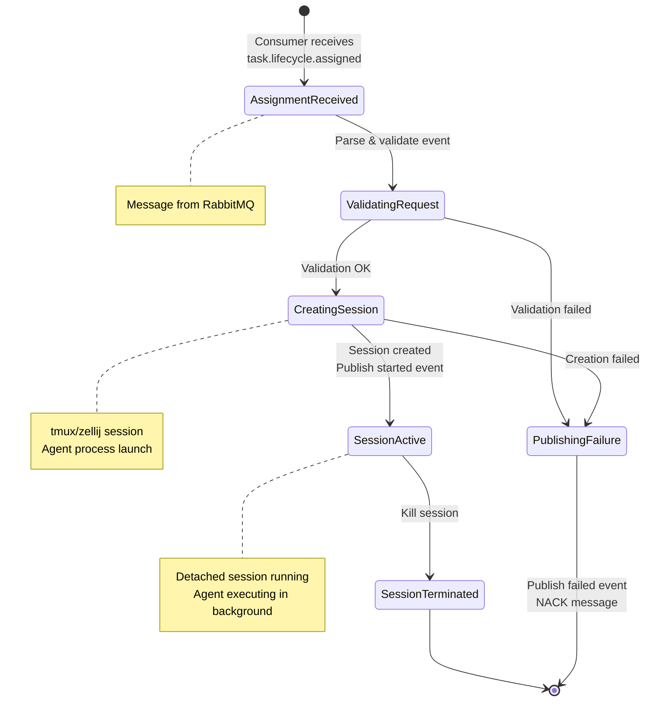
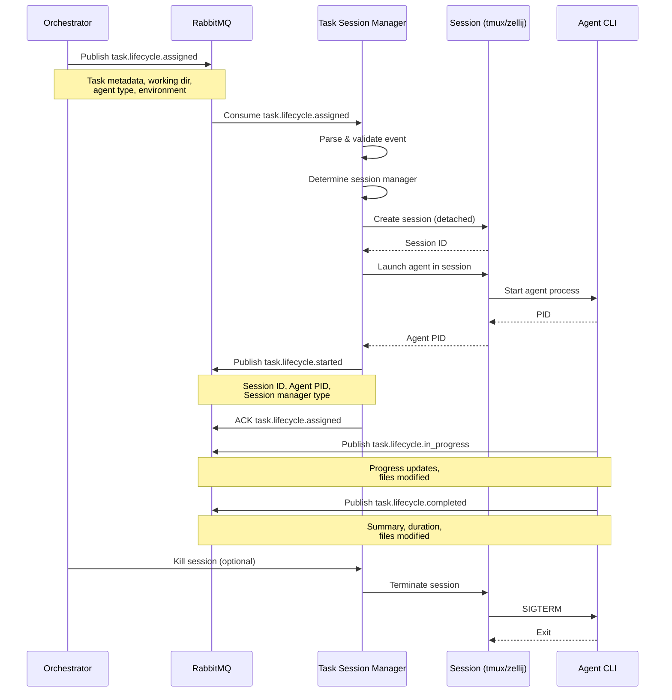
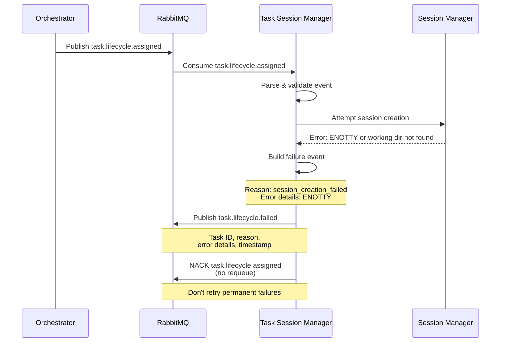
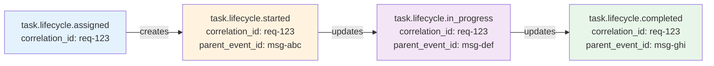

# Event Architecture & State Transitions

## Overview

This document explains the event-driven architecture of the Task Session Manager, including the noun-verb event naming convention, state transitions, and the relationship between **Lifecycle** and **Session** concepts.

## Event Naming Convention

Events follow a hierarchical noun-verb pattern:

```
{domain}.{noun}.{verb}
```

- **Domain**: The system boundary (e.g., `task`)
- **Noun**: The entity being acted upon (e.g., `lifecycle`, `session`)
- **Verb**: The action or state (e.g., `assigned`, `started`, `completed`)

### Event Categories

1. **Lifecycle Events**: Track the overall task execution state
2. **Session Events**: Track the terminal session state (currently merged with lifecycle)

## Core Concepts

### What is a Lifecycle?

A **lifecycle** represents the complete journey of a task from assignment to completion. It encompasses:

- Task assignment and metadata
- Execution progress and updates
- Success, failure, or pause states
- Overall task orchestration

**Lifecycle Focus**: WHAT work needs to be done and its status

### What is a Session?

A **session** represents the technical infrastructure needed to execute a task:

- Terminal multiplexer session (tmux/zellij)
- Working directory and environment
- Agent process and PID
- Session manager type

**Session Focus**: WHERE and HOW the work is executed

### Relationship Between Lifecycle and Session



**Key Points**:
- A lifecycle represents the logical task state
- A session is the physical execution environment
- One lifecycle maps to one session (1:1 relationship)
- Sessions are managed by the Task Session Manager
- Lifecycle state is tracked across the entire system

## Event Structure Breakdown

### Noun-Verb Analysis



### Event Breakdown Table

| Event | Domain | Noun | Verb | Meaning |
|-------|--------|------|------|---------|
| `task.lifecycle.assigned` | task | lifecycle | assigned | Task has been assigned to an agent |
| `task.lifecycle.started` | task | lifecycle | started | Task execution has begun (session created) |
| `task.lifecycle.in_progress` | task | lifecycle | in_progress | Task is actively being worked on |
| `task.lifecycle.paused` | task | lifecycle | paused | Task execution temporarily stopped |
| `task.lifecycle.completed` | task | lifecycle | completed | Task successfully finished |
| `task.lifecycle.failed` | task | lifecycle | failed | Task execution failed |
| `task.session.assigned` | task | session | assigned | Session creation requested |
| `task.session.created` | task | session | created | Terminal session established |
| `task.session.terminated` | task | session | terminated | Session destroyed |

## State Transition Diagrams

### Lifecycle State Machine



### Session State Machine



## Event Flow Sequence

### Happy Path: Task Assignment to Completion



### Error Path: Session Creation Failure



## Event Payload Schemas

### task.lifecycle.assigned

**Purpose**: Request creation of a task session

```json
{
  "task_id": "550e8400-e29b-41d4-a716-446655440000",
  "working_dir": "/home/user/project",
  "agent_type": "claude-code",
  "command": "claude-code task execute",
  "environment": {
    "API_KEY": "sk-...",
    "DEBUG": "true"
  },
  "priority": "high",
  "correlation_id": "req-123",
  "timestamp": "2025-01-26T00:00:00Z",
  "metadata": {
    "user_id": "user-456",
    "project_id": "proj-789"
  }
}
```

**Routing Key**: `task.lifecycle.assigned`

### task.lifecycle.started

**Purpose**: Confirm session created and agent launched

```json
{
  "task_id": "550e8400-e29b-41d4-a716-446655440000",
  "session_id": "task-550e8400-e29b-41d4-a716-446655440000",
  "session_manager": "tmux",
  "agent_pid": 12345,
  "agent_type": "claude-code",
  "working_dir": "/home/user/project",
  "started_at": "2025-01-26T00:00:01Z",
  "correlation_id": "req-123",
  "parent_event_id": "msg-abc",
  "metadata": {
    "user_id": "user-456",
    "project_id": "proj-789"
  }
}
```

**Routing Key**: `task.lifecycle.started`

### task.lifecycle.in_progress

**Purpose**: Report task execution progress

```json
{
  "task_id": "550e8400-e29b-41d4-a716-446655440000",
  "progress_percentage": 45,
  "current_activity": "Running tests",
  "files_modified": [
    "src/main.go",
    "tests/main_test.go"
  ],
  "commands_executed": 12,
  "elapsed_time_seconds": 180,
  "updated_at": "2025-01-26T00:03:01Z",
  "correlation_id": "req-123",
  "parent_event_id": "msg-abc",
  "metadata": {}
}
```

**Routing Key**: `task.lifecycle.in_progress`

### task.lifecycle.completed

**Purpose**: Report successful task completion

```json
{
  "task_id": "550e8400-e29b-41d4-a716-446655440000",
  "summary": "Successfully fixed authentication bug and added tests",
  "completed_at": "2025-01-26T00:10:00Z",
  "duration_seconds": 600,
  "files_modified": [
    "src/auth.go",
    "tests/auth_test.go",
    "docs/AUTH.md"
  ],
  "correlation_id": "req-123",
  "parent_event_id": "msg-abc",
  "metadata": {
    "tests_passed": 45,
    "coverage_increase": "5%"
  }
}
```

**Routing Key**: `task.lifecycle.completed`

### task.lifecycle.failed

**Purpose**: Report task or session failure

```json
{
  "task_id": "550e8400-e29b-41d4-a716-446655440000",
  "reason": "session_creation_failed",
  "error_details": "failed to create zellij session: exit status 101 (stderr: could not get terminal attribute: ENOTTY)",
  "failed_at": "2025-01-26T00:00:02Z",
  "correlation_id": "req-123",
  "parent_event_id": "msg-abc",
  "metadata": {
    "retry_count": 0,
    "session_manager_attempted": "zellij"
  }
}
```

**Routing Key**: `task.lifecycle.failed`

### task.lifecycle.paused

**Purpose**: Indicate task execution paused

```json
{
  "task_id": "550e8400-e29b-41d4-a716-446655440000",
  "reason": "user_requested",
  "paused_at": "2025-01-26T00:05:00Z",
  "correlation_id": "req-123",
  "parent_event_id": "msg-abc",
  "metadata": {
    "progress_at_pause": 60
  }
}
```

**Routing Key**: `task.lifecycle.paused`

## Event Envelope (Optional Wrapper)

Some systems may wrap events in an envelope for additional routing metadata:

```json
{
  "event_type": "task.lifecycle.assigned",
  "routing_key": "task.lifecycle.assigned",
  "correlation_id": "req-123",
  "timestamp": "2025-01-26T00:00:00Z",
  "payload": {
    // ... actual event data ...
  }
}
```

The Task Session Manager handles both:
- Raw events (direct event payload)
- Enveloped events (unwraps and processes payload)

## Lifecycle vs Session Events Comparison

| Aspect | Lifecycle Events | Session Events |
|--------|-----------------|----------------|
| **Scope** | Logical task execution | Physical infrastructure |
| **Emitted By** | Orchestrator, Agent CLI | Task Session Manager |
| **Purpose** | Track task progress | Track session state |
| **Examples** | assigned, completed, failed | created, terminated |
| **Duration** | Entire task lifespan | Session creation to destruction |
| **State Tracking** | Task status across system | Session process on specific machine |

## Event Correlation

All events share common correlation fields to enable distributed tracing:



**Correlation Fields**:
- `correlation_id`: Unique ID for the entire task execution flow
- `parent_event_id`: Message ID of the event that triggered this event
- `task_id`: Unique task identifier

## Implementation in Task Session Manager

The Task Session Manager currently handles:

**Consumed Events**:
- `task.lifecycle.assigned` (via `task.session.assigned` queue)

**Published Events**:
- `task.lifecycle.started` (on success)
- `task.lifecycle.failed` (on error)

**Current Routing**:
```
Queue: task.session.assigned
Routing Key: task.lifecycle.assigned
Exchange: task.events (topic exchange)
```

This merges lifecycle and session concepts because:
1. Session creation is the first lifecycle step
2. Session state directly impacts lifecycle state
3. Simplifies event routing and correlation

## Future Enhancements

### Potential Session-Specific Events

```
task.session.assigned    → Request to create session
task.session.creating    → Session creation in progress
task.session.created     → Session successfully created
task.session.attached    → User attached to session
task.session.detached    → User detached from session
task.session.terminated  → Session destroyed
task.session.migrated    → Session moved to different host
```

### Potential Lifecycle-Specific Events

```
task.lifecycle.queued      → Task queued for execution
task.lifecycle.validated   → Task parameters validated
task.lifecycle.scheduled   → Task scheduled for specific time
task.lifecycle.cancelled   → Task cancelled by user
task.lifecycle.timeout     → Task exceeded time limit
```

## Summary

The event architecture uses a clear noun-verb convention:
- **Lifecycle** events track logical task state
- **Session** events track physical execution environment
- Events are correlated via `correlation_id` and `parent_event_id`
- The Task Session Manager bridges lifecycle and session by consuming assignment events and publishing lifecycle status events

This design enables:
- Clear event semantics
- Distributed tracing
- Loose coupling between components
- Easy debugging and monitoring
- Future extensibility
